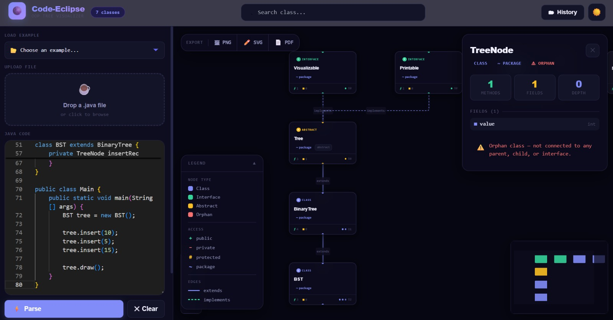
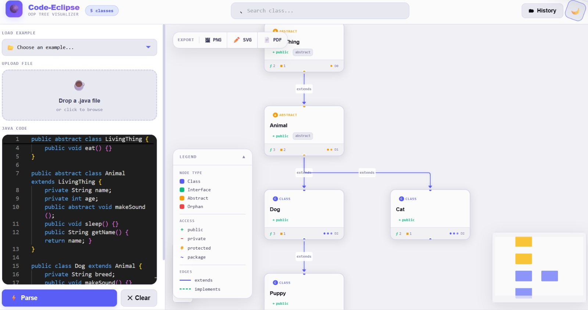
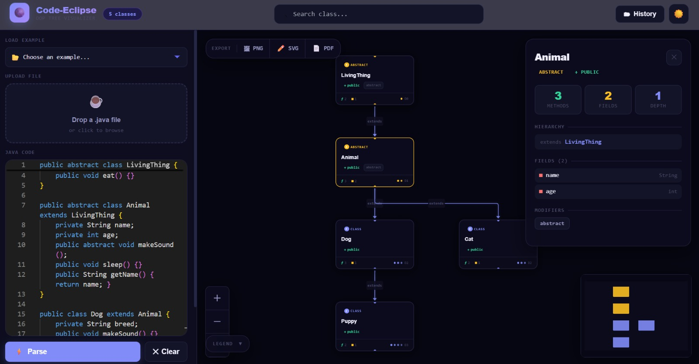
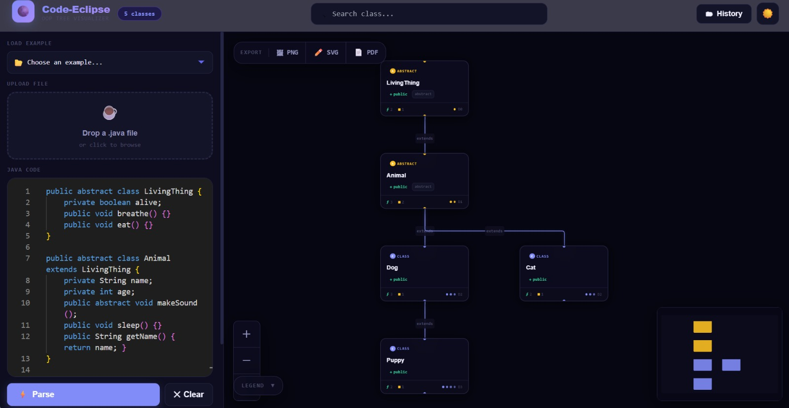

# 🌑 Code-Eclipse

A Java OOP class hierarchy visualizer. Paste or upload Java source code and get an interactive graph of your class relationships — inheritance chains, interfaces, access modifiers, and more.

**Live demo:** https://code-eclipse-omega.vercel.app/

---

## Screenshots









---

## Features

- **Parse Java code** — classes, interfaces, abstract classes, methods, fields, and access modifiers extracted via a modular regex parser
- **Interactive graph** — ReactFlow canvas with Dagre auto-layout; zoom, pan, and drag nodes freely
- **Click-to-inspect** — HoverPanel shows methods, fields, inheritance depth, hierarchy chain, and modifiers for any node
- **Error detection** — flags circular inheritance, missing parent classes, orphan classes, and empty class bodies
- **Export** — download the diagram as PNG, SVG, or PDF
- **Project history** — save, load, and delete parsed projects backed by MongoDB
- **Search** — highlight any class in the graph instantly
- **File upload** — drag and drop a `.java` file (up to 5 MB)
- **Built-in examples** — sample snippets to explore right away
- **Dual theme** — dark and light mode with a glassmorphism design system

---

## Getting Started

**Requirements:** Node 18+, MongoDB (local or Atlas)

### Backend

```bash
cd backend
npm install
```

Create `backend/.env`:

```
PORT=5000
MONGO_URI=mongodb://localhost:27017/code-eclipse
```

```bash
npm start
```

### Frontend

```bash
cd frontend
npm install
npm run dev
```

Open http://localhost:5173

---

## Project Structure

```
Code-Eclipse/
├── backend/
│   ├── server.js
│   ├── models/
│   │   └── projects.js           # Mongoose schema
│   ├── routes/
│   │   ├── parse.js              # POST /api/parse
│   │   ├── upload.js             # POST /api/upload
│   │   └── projects.js           # CRUD /api/projects
│   └── parser/
│       ├── classExtractor.js
│       ├── memberParser.js
│       ├── accessParser.js
│       ├── modifierParser.js
│       ├── inheritanceParser.js
│       ├── depthCalculator.js
│       ├── orphanDetector.js
│       ├── errorCollector.js
│       └── methodCounter.js
│
└── frontend/
    └── src/
        ├── App.jsx
        ├── api/
        │   └── projectApi.js
        ├── samples/
        │   └── snippets.js
        ├── utils/
        │   └── exportGraph.js
        └── components/
            ├── Navbar.jsx
            ├── CodeEditor.jsx
            ├── FileUpload.jsx
            ├── SnippetDropdown.jsx
            ├── TreeCanvas.jsx
            ├── ClassNode.jsx
            ├── HoverPanel.jsx
            ├── Legend.jsx
            ├── ExportBar.jsx
            ├── ErrorPanel.jpeg
            └── ProjectHistory.jsx
```

---

## API

### `POST /api/parse`

```json
{ "code": "public class Foo extends Bar { ... }" }
```

Returns `{ nodes, edges, classes, errors }`.

### `POST /api/upload`

`multipart/form-data`, field `file`, `.java` only, max 5 MB.  
Returns `{ code, filename, size }`.

### Projects

| Method | Endpoint            | Action   |
| ------ | ------------------- | -------- |
| GET    | `/api/projects`     | List all |
| GET    | `/api/projects/:id` | Get one  |
| POST   | `/api/projects`     | Save     |
| DELETE | `/api/projects/:id` | Delete   |

---

## Tech Stack

**Frontend** — React 18, Vite, ReactFlow, Dagre, Monaco Editor, Tailwind CSS, html-to-image, jsPDF, Axios

**Backend** — Express, Mongoose, Multer, CORS, dotenv

---

## Built By

- **Saksham Varshney**
- **Suraj Kumar Gupta**

---

## License

MIT
